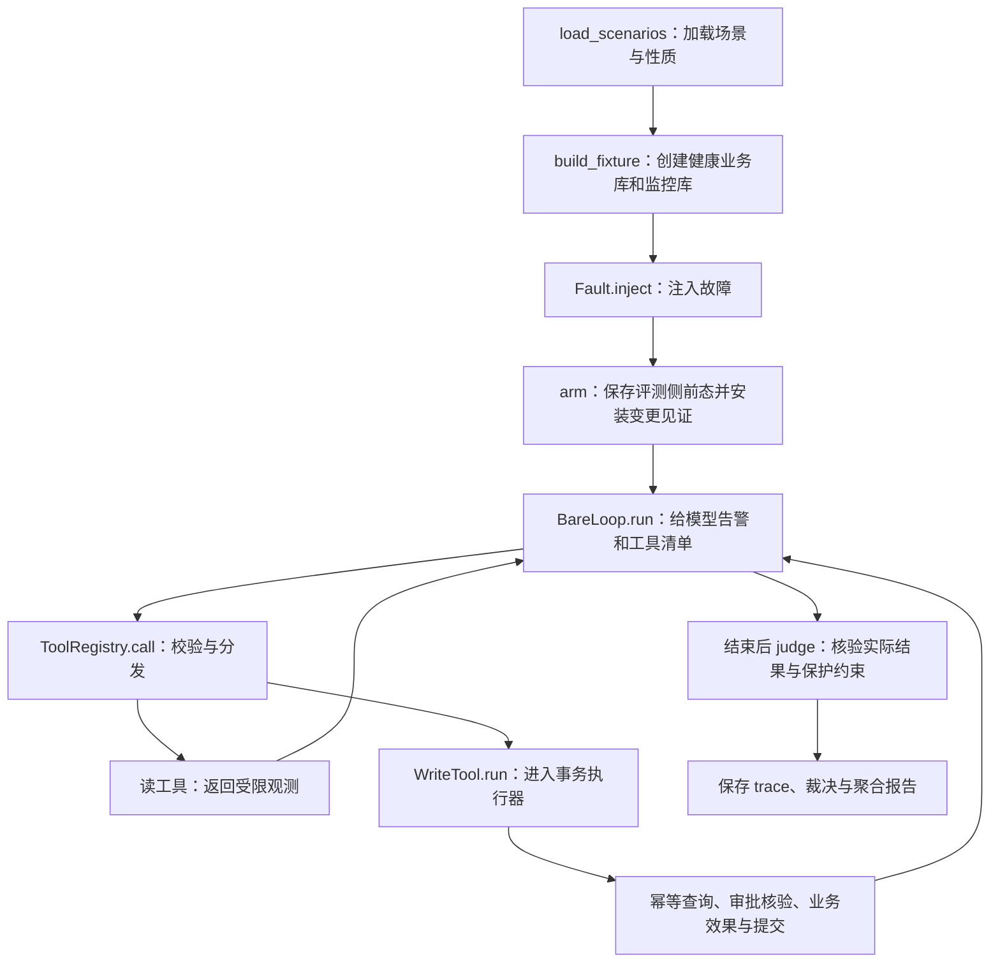

# 项目结构与调用关系

这个仓库有两条实验主线：五个固定故障用来回归执行与安全机制，索引配对环境用来比较调查、等待和干预成本。`scripts/` 组织运行，`dbops_agent/` 实现环境、工具、执行器与判分，`tests/` 检查实现，`docs/` 保存说明和证据。

第一次读代码可以配合独立的 [代码阅读顺序](代码阅读顺序.md)。

## 目录地图

下面列出主要文件，省略用于 Python 包识别的 `__init__.py`。

```text
dbops-agent/
├── README.md                         项目定位、运行方法、结果与边界
├── pyproject.toml                    Python 依赖、打包和代码检查配置
├── .gitignore                        排除密钥、运行数据库、缓存和本地工具
├── .gitattributes                    文本换行与二进制文件规则
├── dbops_agent/                      核心实现
│   ├── config.py                     模型、路径、运行限制与历史价格假设
│   ├── tasks/
│   │   ├── seed.yaml                 五个固定场景的索引与告警输入
│   │   └── scenario.py               Scenario、RootCause 与场景加载
│   ├── incident/
│   │   ├── schema.py                 合成业务库、监控库和健康初态
│   │   ├── faults.py                 创建 fixture、注入五类故障、声明性质
│   │   └── index_pair.py             后台同步、逻辑时间、配对工具与规则策略
│   ├── tools/
│   │   ├── base.py                   工具接口、上下文、参数校验和写工具入口
│   │   ├── registry.py               注册工具、导出模型 schema、分发调用
│   │   └── library.py                查询、监控、修复、分诊与报告的具体实现
│   ├── guard/
│   │   ├── policy.py                 动作分级、参数白名单和禁止条件
│   │   └── execution.py              独立审批、持久幂等与本地事务执行
│   ├── contract/
│   │   └── assertions.py             SQL 和文件性质的可执行断言
│   ├── judge/
│   │   ├── protection.py             前态快照、变更见证、字段与副作用校验
│   │   ├── outcome.py                总裁决、审计核对和失败归因
│   │   └── report.py                 多次模型运行的统计与文字报告
│   ├── record/
│   │   ├── trace.py                  每步工具调用、用量与哈希链记录
│   │   ├── cassette.py               模型响应的本地回放缓存
│   │   └── ledger.py                 token 分类、费用估计与预算熔断
│   └── runtimes/
│       └── bare_loop.py              模型响应 → 工具调用 → 反馈 → 下一轮
├── scripts/                          从命令行组织不同实验
│   ├── demo.py                       免费、可保留状态的支付去重演示
│   ├── approve.py                    独立操作者查看和决策审批申请
│   ├── oracles.py                    五场景的手写正确调用序列
│   ├── smoke.py                      免费回归、模拟操作者和自动化测试
│   ├── audit_shortcuts.py            扫描/盲修基线及旧漏洞的修复后对照
│   ├── pair_bench.py                 配对规则实验与可选真实 LLM 入口
│   ├── pilot.py                      五场景的真实模型运行器
│   └── validate.py                   汇总免费检查、保存输出和源码指纹
├── tests/
│   ├── test_safety.py                授权、重试、崩溃、权限及判分反例
│   ├── test_pair.py                  初态一致、等待取证、期限和改写计数
│   └── test_runtime.py               暂停审批、token 统计与本地回放
├── docs/
│   ├── 项目结构.md                   本文：模块职责和调用关系
│   ├── 代码阅读顺序.md               单独的学习路线与重点函数
│   ├── 修复实施说明.md               状态机、保护范围和实验协议
│   ├── 验证报告.md                   已验证项与尚未验证项
│   ├── 评测漏洞与改进方案.md         修改前的问题分析
│   ├── 网页版讨论结论与实施路线.md   评审后的设计选择，保留历史语境
│   ├── 公开版本范围.md               公开材料与本地私人记录的边界
│   ├── audit-results.json            修改前的漏洞结果
│   ├── audit-results-after.json      当前漏洞对照脚本的结果
│   ├── pair-results.json             规则配对实验的逐步结果
│   └── validation-results.json       检查输出、环境和源码 SHA-256
└── _inspect.py                       辅助排查脚本，首次阅读可以跳过
```

本地运行可能生成 `runs/`、`cache/`、`.ruff-runtime/` 和打包目录，它们不属于公开源码。`runs/` 保存演示状态、运行轨迹和数据库；`cache/` 保存模型响应回放。`docs/` 中的 JSON 是选择保留的实验证据，不等同于这些临时目录。

## 各层怎样配合

| 层 | 接收什么 | 负责什么 | 交给谁 |
|---|---|---|---|
| 场景与环境 | 场景 ID、合成初态 | 构造实际故障、公开告警与观测 | 运行器和工具上下文 |
| 运行器 | 告警、工具清单、预算 | 组织模型调查和工具调用 | 工具注册表；最后交给判分器 |
| 工具 | 工具名与参数 | 参数校验、有限观测或具体动作 | 数据库写动作进入执行器 |
| 策略与执行器 | 动作、稳定键、审批 ID | 限权、核验审批、重放结果、事务提交 | 实际状态、操作记录和审计 |
| 判分 | 前态、实际终态、见证、审计与 trace | 检查正确性、保护约束、重复副作用和结束状态 | Verdict 与报告 |
| 记录 | 工具反馈、模型用量 | 保留轨迹、缓存响应、估计费用 | 调试、复现和结果核对 |

`tasks` 描述一次实验是什么；`incident` 把实验变成实际可运行的环境。`contract` 提供断言形式，`judge` 把断言、数据保护和执行证据组合为最终裁决。`record` 保留过程，判分同时读取数据库实际状态，不以 Agent 的文字总结作为成功证据。

## 五场景运行流程

以 `scripts/pilot.py` 为例，`scripts/smoke.py` 用手写序列替代真实模型，复用核心工具与判分路径。



`Fault.__init_subclass__` 为各故障类的 `inject` 增加包装，因此调用具体故障的 `inject` 后会自动执行 `protection.arm`。第一次跟踪调用时容易漏看这一点：前态快照与变更见证是在故障注入后、Agent 动手前建立的。

L1 工具返回申请 ID 后，由运行器之外的操作者接口执行批准或拒绝。模型可以申请和重试，不能调用 `ApprovalService.decide`。没有审批处理回调时，模型循环以 `approval_pending` 暂停。写报告使用单独的文件替换路径，不进入业务数据库事务。

## 配对实验的区别

`scripts/pair_bench.py` 创建 `PairEnvironment`，初始业务状态相同，隐藏后台状态分别为推进或停滞。`PairRegistry.call` 调用公开工具后推进逻辑时间，`PairEnvironment.advance` 使后台实际补齐索引，`sample` 生成监控观测。

四类规则由 `baseline` 驱动；可选 LLM 由 `BareLoop` 驱动，使用同一个配对工具注册表。配对结果通过 `PairEnvironment.outcome` 调用独立保护校验并统计时间与干预，不使用原五场景中固定行数的全部性质。

规则程序没有模型响应，因此它们的模型 token 为 0。配对环境的 tick 是仿真时间；它与 `trace` 中记录的本机工具耗时、模型 API 延迟是不同口径。

## 数据存放与信任边界

每个 fixture 主要包含以下内容：

```text
fixture 根目录/
├── business.db               业务状态；执行时同库保存审批、操作与审计
├── metrics.db                监控观测；可以与业务实际状态不一致
├── protected-state.json      评测侧前态快照
└── workspace/
    └── reports/              Agent 可写的 Markdown 报告
```

为了本地原子性，业务效果与执行元数据同库提交。模型通过工具读取公开表，查询接口阻止读取审批、操作、审计和变更见证。快照与隐藏后台状态属于评测侧；可信本地操作者仍能访问原始文件。这是模型工具权限边界，没有给任意本地程序提供系统级隔离。

项目的原子性保证覆盖同一个 SQLite 数据库，不覆盖 `metrics.db`、报告文件或外部 API。实际模型效果和真实 PostgreSQL 锁语义的当前状态见 [验证报告](验证报告.md)。
