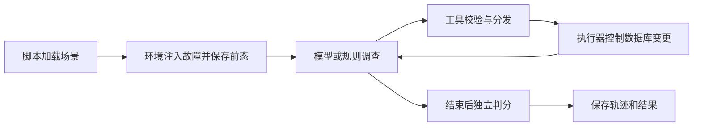

# 项目结构

`dbops_agent/` 实现核心逻辑，`scripts/` 组织运行，`tests/` 验证实现，`docs/` 解释设计与结果。代码从哪里读起见独立的 [代码阅读顺序](代码阅读顺序.md)。

## 模块地图

```text
dbops-agent/
├── dbops_agent/
│   ├── config.py     模型、路径、限制与费用假设
│   ├── tasks/        场景定义和加载
│   ├── incident/     合成数据、故障注入和配对环境
│   ├── tools/        工具接口、注册与具体读写
│   ├── guard/        权限、独立审批与事务执行
│   ├── contract/     SQL 和文件断言
│   ├── judge/        数据保护、总裁决和统计报告
│   ├── record/       轨迹、响应回放和用量记录
│   └── runtimes/     模型循环
├── scripts/          演示与实验入口
├── tests/            安全、配对和运行时测试
├── docs/
│   ├── 项目结构.md
│   ├── 代码阅读顺序.md
│   ├── 设计说明.md
│   ├── 验证报告.md
│   └── results/      原始结果与完整轨迹
└── pyproject.toml    依赖、打包与代码检查配置
```

| 模块 | 主要文件 | 职责 |
|---|---|---|
| `tasks` | `scenario.py`、`seed.yaml` | 定义场景输入，加载性质与根因标签 |
| `incident` | `schema.py`、`faults.py`、`index_pair.py` | 创建合成环境，注入故障，推进后台同步 |
| `tools` | `base.py`、`registry.py`、`library.py` | 校验参数、分发模型调用、提供受限操作 |
| `guard` | `policy.py`、`execution.py` | 检查权限，核验审批，执行幂等事务 |
| `contract` | `assertions.py` | 把领域性质变成可执行检查 |
| `judge` | `protection.py`、`outcome.py`、`report.py` | 核验实际状态、保护约束和统计结果 |
| `record` | `trace.py`、`cassette.py`、`ledger.py` | 保存过程、回放响应、统计用量与估计费用 |
| `runtimes` | `bare_loop.py` | 告警 → 模型响应 → 工具反馈 → 下一轮 |

## 一次运行怎样经过这些模块



五场景由 `load_scenarios` 读取输入，再通过 `build_fixture` 和故障类的 `inject` 落地。`Fault.__init_subclass__` 包装注入方法，自动在注入后建立前态快照与变更见证。

真实模型由 `BareLoop.run` 组织调查；免费回归使用手写调用序列。两者复用工具和执行器。L1 审批由独立操作者接口决策，模型不能批准自己；写报告走单独的文件路径。

配对实验由 `PairEnvironment` 和 `PairRegistry` 推进逻辑时间。规则与可选 LLM 使用同一组工具，结果通过 `PairEnvironment.outcome` 核验内容、保护约束和成本。机制详见 [设计说明](设计说明.md)。

## 运行入口

| 脚本 | 用途 |
|---|---|
| `demo.py`、`approve.py` | 免费支付去重演示与独立审批 |
| `oracles.py`、`smoke.py` | 手写正确序列、五场景回归和自动化测试 |
| `audit_shortcuts.py` | 旧漏洞与简单策略的修复后对照 |
| `pair_bench.py` | 配对规则实验；`--llm` 才调用模型 |
| `pilot.py` | 五场景的真实模型实验 |
| `validate.py` | 汇总免费验证、代码检查与源码指纹 |

测试分为 `test_safety.py`、`test_pair.py`、`test_runtime.py`。辅助 `_inspect.py` 和各目录的 `__init__.py` 可在首次阅读时跳过。

## 数据放在哪里

每个实验目录包含 `business.db`、`metrics.db`、评测侧 `protected-state.json` 和 Agent 的 `workspace/reports/`。为了原子提交，业务与执行元数据同库；模型只通过工具读取允许的公开表。

本地 `runs/`、`cache/` 和工具目录不进 Git。选择保留的证据放在 `docs/results/`：旧漏洞结果、当前漏洞结果、配对轨迹、验证输出与源码指纹。结果解释统一见 [验证报告](验证报告.md)。
